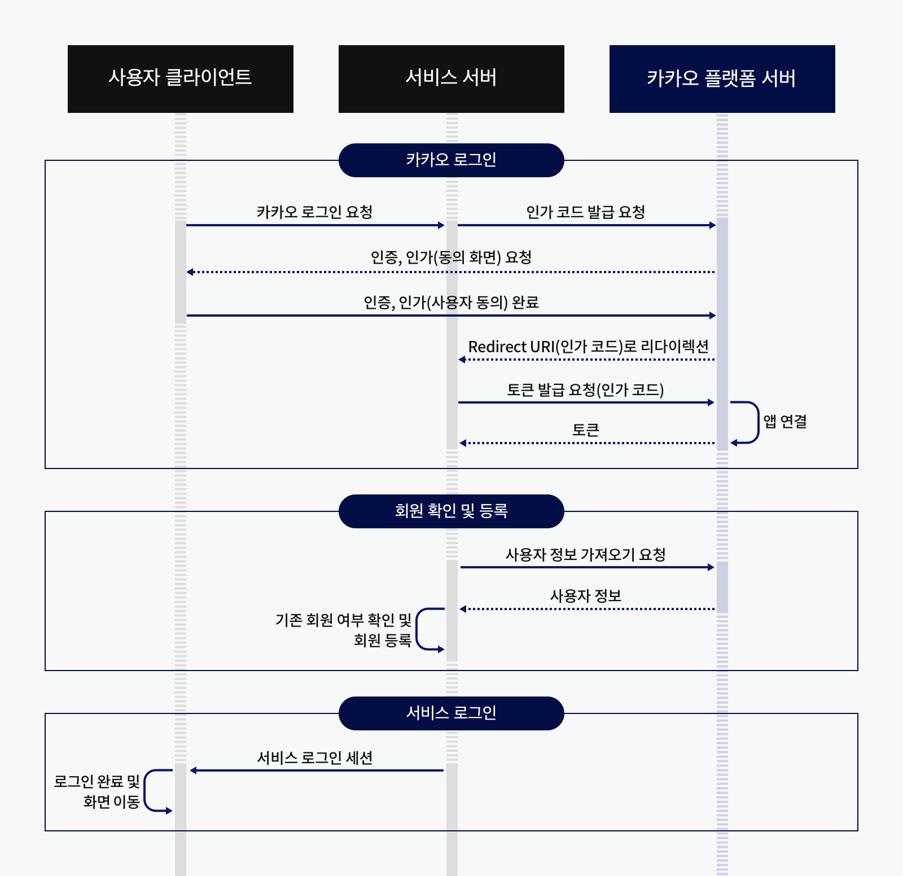

# OAuth 플랫폼 테스트

OAuth 2.0 Flow를 통해 Provider 서버로부터 인가 코드를 Redirect 받는 EndPoint 입니다.

<figure><figcaption>
Kakao Login Flow
</figcaption></figure>

현재 EveryPin 앱은 앱(Front-End)에서 \[인증,인가 완료] 후, 인가 코드를 API서버(Back-end)로 보내줍니다.

해당 EndPoint는 인가 코드를 웹 환경에서 확인할 수 있는 Redirect 전용 Endpoint입니다.

